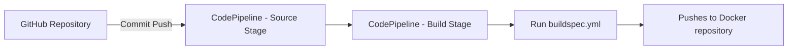

<h2 align="center">AWS CI Project</h2>

<hr/>

<h2>CI Pipeline (AWS CodeBuild & CodePipeline)</h2>

<p>
This repository includes a fully automated CI pipeline built using 
<strong>AWS <strong>CodeBuild</strong>, and <strong>CodePipeline</strong> functionalities.
The pipeline is triggered by the commit from GitHub.
</p>

<h2>✅ What I Implemented</h2>

<h3>1. CodeBuild Project Setup</h3>
<ul>
  <li>Created a dedicated CodeBuild project.</li>
  <li>Wrote build steps in the CodeBuild buildspec.</li>
</ul>

```yaml
version: 0.2

env:
  parameter-store:
    DOCKER_USERNAME: docker-username
    DOCKER_PASSWORD: docker-password
    DOCKER_REGISTRY: docker-registry-url
phases:
  install:
    runtime-versions:
      python: 3.11
  pre_build:
    commands:
      - pip install -r requirements.txt
  build:
    commands:
      - echo "Building Docker image"
      - echo "$DOCKER_PASSWORD" | docker login -u "$DOCKER_USERNAME" --password-stdin "$DOCKER_REGISTRY"
      - docker build -t "$DOCKER_REGISTRY/$DOCKER_USERNAME/aws-project-1:latest" .
      - docker push "$DOCKER_REGISTRY/$DOCKER_USERNAME/aws-project-1:latest"
  post_build:
    commands:
      - echo "Build is successful"
```

<h3>2. CodePipeline Setup</h3>
<ul>
  <li>Created a dedicated CodePipeline.</li>
  <li>Configured the pipeline’s Source stage to pull code from the repository automatically.</li>
  <li>Configured pipeline to use AWS Codebuild attaching the created build.</li>
</ul>

<h3>3. IAM Role Fixes</h3>
<ul>
  <li>Identified that CodePipeline was incorrectly using the CodeBuild service role.</li>
  <li>Updated the pipeline to use the correct new role.</li>
</ul>

<h3>4. Pipeline Validation</h3>
<ul>
  <li>Re-ran the pipeline after fixing IAM.</li>
  <li>Confirmed successful source retrieval, build execution, and artifact generation.</li>
</ul>

<hr/>

<h2> CI/CD Flowchart </h2>



<hr/>


<hr/>


